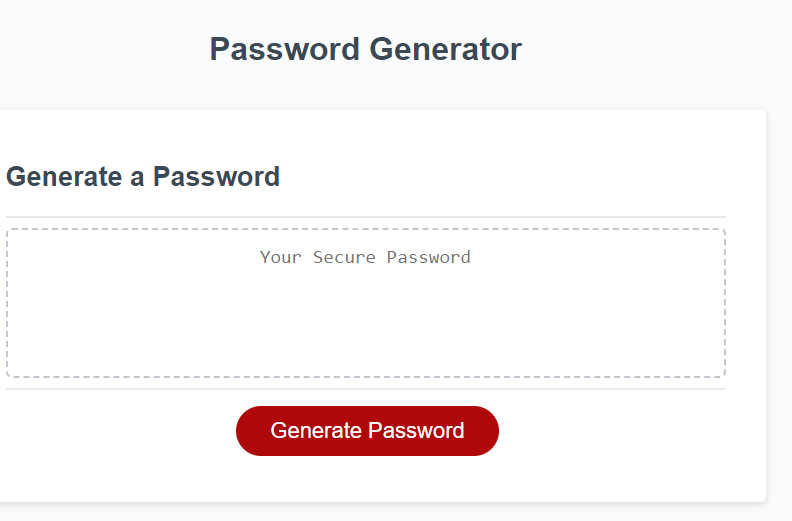
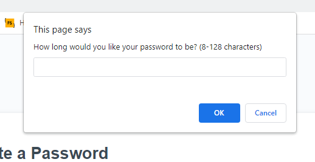
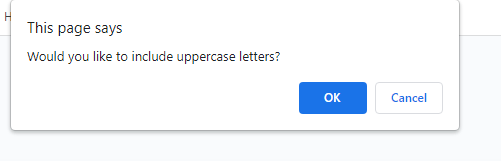
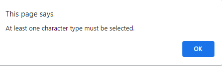
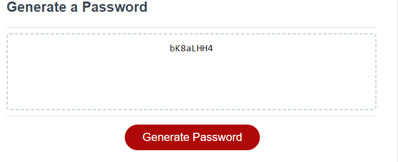

# JavaScript-Password-Generator
## Password Generator

I created a password generator that allows the user to select the length of the password (between 8 and 128 characters) and the types of characters to include (uppercase letters, lowercase letters, numbers, and symbols).

The Password that is generated shows up inside the box frame that uses the selected characters that defines the outcome

# How it works

Click the "Generate Password" button to start the generator.
 

Enter the desired length of your password (between 8 and 128 characters) in the prompt that appears.

Choose whether to include uppercase letters, lowercase letters, numbers, and symbols by answering the corresponding prompts.

If you did not select at least one character type, an alert will appear asking you to select at least one character type.

The generated password will be displayed in the #password input box.

Site Link
https://markaamaro.github.io/JavaScript-Password-Generator/

